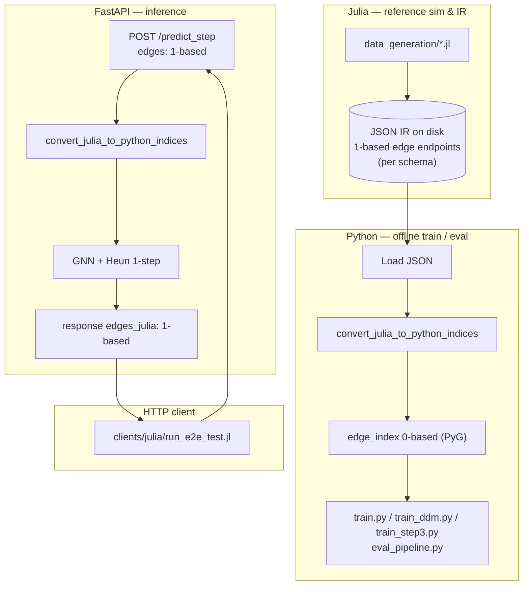

# Physics GNN Surrogate · Long Rollout Stabilization

[](https://github.com/kohmaruworks/physics-gnn-surrogate-long-rollout/actions/workflows/ci.yml)
[](https://julialang.org/)
[](https://www.python.org/)
[](https://pytorch-geometric.readthedocs.io/)

[🇺🇸 English](#english) | [🇯🇵 日本語](#japanese)

<a id="english"></a>

## English

### Overview

This repository trains and evaluates **physics-informed graph surrogates** for discrete wave dynamics at scale, with emphasis on **stable long autoregressive rollouts**. Core goals:

- **Time stabilization** — **Heun (improved Euler)** integration of the learned vector field \(f_\theta(h) \approx dh/dt\) *outside* the raw message-passing stack, plus an optional **symplectic / Hamiltonian penalty** to curb energy drift over many steps.
- **Spatial scale-out** — **domain decomposition (DDM)** with **METIS** partitioning and **halo exchange** between subdomains each macro-step.
- **Multigrid + tensor message passing** — structured **restriction / prolongation** (sparse COO generated in Julia, consumed in PyTorch) and **einsum-style** bond contraction for longer-range interactions on graphs.

Reference trajectories and graph IR are produced in **Julia**; training, inference API, and evaluation run in **Python (PyTorch / PyTorch Geometric)**. The two sides are **loosely coupled through versioned JSON**, with **index semantics fixed at the boundary** so round-trips are safe and auditable.

**Heun update** (intermediate state \(\tilde{h}^{(t+1)}\) is formed explicitly in code):

$$
h^{(t+1)} = h^{(t)} + \frac{\Delta t}{2} \left( f_{\theta}(h^{(t)}) + f_{\theta}(\tilde{h}^{(t+1)}) \right)
$$

**Zero-shot autoregressive rollout RMSE** (used in the evaluation pipeline; \(\hat{u}\) prediction, \(u\) reference, \(V\) nodes, \(T\) steps):

$$
\text{RMSE}_{rollout} = \sqrt{ \frac{1}{T \cdot |V|} \sum_{t=1}^{T} \sum_{i \in V} \left\| \hat{u}_i^{(t)} - u_i^{(t)} \right\|^2}
$$

Related repos for smaller baselines: **[physics-gnn-surrogate-basic](https://github.com/kohmaruworks/physics-gnn-surrogate-basic)**, **[physics-gnn-surrogate-act](https://github.com/kohmaruworks/physics-gnn-surrogate-act)**.

### Architecture

| Layer | Responsibility |
| --- | --- |
| **Julia** | Reference PDE / ODE integration, graph and multigrid metadata, JSON IR emission, optional wall-clock timing for ROI-style comparison. Vertex and edge indices follow **1-based** Julia conventions in emitted payloads **where the schema specifies it**. |
| **Python** | Dataset load, **index conversion to 0-based PyG `edge_index`**, training (`train.py`, `train_ddm.py`, `train_step3.py`), **FastAPI** inference, and evaluation (`evaluation/eval_pipeline.py`). |
| **JSON IR** | Single source of truth for topology, features, and optional sparse COO blocks; keeps Julia and Python **replaceable** behind a stable schema. |

**Index safety (1-based ↔ 0-based).** Julia stacks typically use **1-based** indexing; PyTorch Geometric expects **0-based** `edge_index`. This project **does not** hide that ambiguity in ad hoc math: **conversion is applied in the Python data-load path** via helpers such as `convert_julia_to_python_indices` (and sparse COO helpers where applicable), and the **HTTP API** documents a **1-based wire format** for edges while internally converting before `forward`. That yields a clear, testable **round-trip contract** at the API and loader layers—reducing off-by-one failures when mixing languages.

#### Architecture diagram

The diagram below is **language-neutral** (labels in English for tooling compatibility). **Julia** emits **versioned JSON**; **Python** consumes it for **offline training/evaluation** after converting to **0-based PyG indices**. The **FastAPI** service accepts **1-based** edges over HTTP, converts internally, runs **Heun + GNN**, and returns **1-based** `edges_julia` so clients (e.g. `clients/julia/run_e2e_test.jl`) never perform ad hoc ±1 fixes—**indexing is centralized at the Python boundary**.



Compositionality (*functor-style* building blocks): local message passing, Heun integration, halo sync (DDM), and restriction/prolongation are kept in **separate modules** so pipelines are assembled by **composition** rather than monolithic scripts.

### Repository layout

```text
physics-gnn-surrogate-long-rollout/
├── .github/workflows/ci.yml
├── api/                       # FastAPI inference service (Heun single-graph checkpoints)
├── clients/julia/             # Julia HTTP client; run_e2e_test.jl
├── data_generation/           # Julia IR generators + JSON schemas
├── evaluation/                # Metrics, profiler, eval_pipeline.py
├── surrogate_model/           # Model, training entry points, index_converter, DDM, multigrid, …
├── data/interim/              # Generated JSON & checkpoints (.gitignore; .gitkeep tracked)
├── Project.toml / Manifest.toml
├── requirements.txt
├── LICENSE
└── README.md
```

**Note:** sibling baseline **[physics-gnn-surrogate-basic](https://github.com/kohmaruworks/physics-gnn-surrogate-basic)** normalizes some edge endpoints to 0-based **in JSON at Julia export**; **this repo** may emit **1-based** endpoints per schema and normalize **in Python**—both styles share the same principle: **fix semantics at a documented boundary**.

### Getting started

**Julia** — use a Julia version consistent with `Manifest.toml` (CI uses the same minor series). [juliaup](https://github.com/JuliaLang/juliaup) or official binaries are fine.

```bash
git clone https://github.com/kohmaruworks/physics-gnn-surrogate-long-rollout.git
cd physics-gnn-surrogate-long-rollout
julia --project=. -e 'using Pkg; Pkg.instantiate()'
```

The root `Project.toml` is an **environment** only (no `name` / `uuid` package fields), matching the sister repos—otherwise Julia precompile can fail without a `src/` layout.

**Python**

```bash
python3 -m venv .venv
source .venv/bin/activate   # Windows: .venv\Scripts\activate
pip install -r requirements.txt
```

For CUDA, install a matching **PyTorch** build first, then align **PyTorch Geometric** wheels with [official PyG instructions](https://pytorch-geometric.readthedocs.io/en/latest/install/installation.html).

**Minimal wave data + smoke training (single-domain Step 1)**

```bash
julia --project=. data_generation/generate_wave_data.jl
python surrogate_model/train.py --cpu    # omit --cpu if using GPU
```

Artifacts default to `data/interim/` (gitignored except `.gitkeep`). CI runs an equivalent Julia generate → index smoke → short `train.py` path; see [`.github/workflows/ci.yml`](.github/workflows/ci.yml).

### Usage

#### Training and evaluation (summary)

| Track | Julia data | Python entry | Typical artifact |
| --- | --- | --- | --- |
| Single grid + Heun | `data_generation/generate_wave_data.jl` | `surrogate_model/train.py` | `data/interim/wave_rollout_step1.json`, `wave_rollout_step1_model.pth` |
| DDM + halo | `data_generation/generate_large_wave_data.jl` | `surrogate_model/train_ddm.py` | `wave_rollout_ddm_v1.json`, `wave_rollout_ddm_model.pth` |
| Multigrid + tensor MP | `data_generation/generate_multigrid_data.jl` | `surrogate_model/train_step3.py` | `multigrid_wave_v1.json`, `hierarchical_step3_model.pth` |
| Zero-shot eval + ROI | `data_generation/generate_eval_data.jl` | `evaluation/eval_pipeline.py` | `eval_zero_shot_v1.json`, report under `reports/` (gitignored) |

Useful `train.py` flags include `--lambda-symp`, `--rollout-min` / `--rollout-max` (curriculum), and `--val-split`. DDM training supports `--microbatch-subdomains` and `--joint-ddm-loss`; see script headers for defaults.

**Evaluation example** (repository root):

```bash
python evaluation/eval_pipeline.py \
  --eval-json data/interim/eval_zero_shot_v1.json \
  --checkpoint data/interim/hierarchical_step3_model.pth
```

#### FastAPI inference server

**Scope:** **single-graph `PhysicsGNNSurrogate` (Step 1 / Heun)** checkpoints. Hierarchical checkpoints with multigrid `meta` are **not** served by this API in the current version.

**Index contract:** clients send **`edges` as 1-based `[src, dst]` pairs** (Julia-style). The server runs **`convert_julia_to_python_indices`** to build **0-based `edge_index`**, steps the model with Heun, and returns **`edges_julia`** as **1-based pairs** again for round-trip checks.

From the repository root (after `pip install -r requirements.txt`):

```bash
source .venv/bin/activate
export SURROGATE_CHECKPOINT=data/interim/wave_rollout_step1_model.pth
export SURROGATE_DEVICE=cpu        # or cuda when available
uvicorn api.main:app --reload --host 127.0.0.1 --port 8000
```

Open **`http://127.0.0.1:8000/docs`** for OpenAPI.

**Health check and sample `curl`** (edges **1-based**):

```bash
curl -s http://127.0.0.1:8000/health

curl -s http://127.0.0.1:8000/predict_step \
  -H 'Content-Type: application/json' \
  -d '{
    "num_nodes": 4,
    "node_features": [[0.0, 0.0], [0.0, 0.0], [0.0, 0.0], [0.0, 0.0]],
    "edges": [
      [1, 2], [2, 1], [3, 4], [4, 3],
      [1, 3], [3, 1], [2, 4], [4, 2]
    ]
  }'
```

#### Julia end-to-end API test

With **`uvicorn` still running** in another terminal, from the repository root:

```bash
julia --project=. -e 'using Pkg; Pkg.instantiate()'
julia --project=. clients/julia/run_e2e_test.jl
```

Defaults: `http://127.0.0.1:8000` and `data/interim/wave_rollout_step1.json`. Optional arguments:

```bash
julia --project=. clients/julia/run_e2e_test.jl http://127.0.0.1:9000
julia --project=. clients/julia/run_e2e_test.jl http://127.0.0.1:8000 path/to/other.json
```

The client posts **the same 1-based edges and node order** as the IR; it does **not** apply ±1 locally—the server performs conversion.

### Symplectic loss (training)

$$
\mathcal{L}_{total} = \mathcal{L}_{data} + \lambda_{symp} \sum_{t} \left\| \mathcal{H}(h^{(t+1)}) - \mathcal{H}(h^{(t)}) \right\|^2
$$

### Algorithms (short)

- **Step 1:** Heun integration of \(f_\theta\), symplectic Hamiltonian penalty on discrete \(\mathcal{H}\), sliding-window supervised rollout.
- **DDM:** METIS partitions, teacher-forced or joint halo losses; `sync_halo_features` after each Heun macro-step.
- **Multigrid:** fine/coarse grids with sparse \(R\), \(P\); tensor message passing via `einsum`; composed inside `HierarchicalPhysicsGNN`.

### Contributing

Issues and PRs are welcome. For larger changes, please open an issue first. Large generated files under `data/interim/` and `reports/` remain **gitignored**; commit only reproducible scripts and manifests.

### License

This project is licensed under the **MIT License** — see the [`LICENSE`](LICENSE) file.

---

<a id="japanese"></a>

## 日本語

### プロジェクト概要

離散波動系を対象に、**大規模マルチフィジックス**と**自己回帰ロールアウトの長期安定性**を両立する **物理情報付きグラフ GNN サロゲート** です。主な狙いは次のとおりです。

- **時間方向** — 学習したベクトル場 \(f_\theta(h) \approx dh/dt\) に対し、メッセージパッシング本体とは切り離した **Heun 法（改良オイラー）** で更新し、必要に応じて **離散ハミルトニアンに基づく Symplectic 損失** で長期のエネルギー漂移を抑える。
- **空間方向** — **METIS による領域分割（DDM）** と **Halo 同期** でサブドメイン並列・メモリ効率を改善。
- **マルチグリッド** — Julia が出力する **Restriction / Prolongation の COO** と **テンソル型メッセージパッシング（einsum）** で長距離相関を扱いやすくする。

参照軌道とグラフ IR は **Julia**、学習・推論 API・評価は **Python（PyTorch / PyG）**。**版付き JSON** で疎結合にし、**インデックス意味を境界で固定**して監査しやすくしています。

**Heun 更新**（\(\tilde{h}^{(t+1)}\) は実装で明示的に構成）:

$$
h^{(t+1)} = h^{(t)} + \frac{\Delta t}{2} \left( f_{\theta}(h^{(t)}) + f_{\theta}(\tilde{h}^{(t+1)}) \right)
$$

**ゼロショット自己回帰ロールアウト RMSE**（\(\hat{u}\) 予測、\(u\) 参照、\(V\) 頂点集合、\(T\) ステップ）:

$$
\text{RMSE}_{rollout} = \sqrt{ \frac{1}{T \cdot |V|} \sum_{t=1}^{T} \sum_{i \in V} \left\| \hat{u}_i^{(t)} - u_i^{(t)} \right\|^2}
$$

小規模ベースライン: **[physics-gnn-surrogate-basic](https://github.com/kohmaruworks/physics-gnn-surrogate-basic)**、拡張デモ: **[physics-gnn-surrogate-act](https://github.com/kohmaruworks/physics-gnn-surrogate-act)**。

### アーキテクチャ担当分担

| 層 | 役割 |
| --- | --- |
| **Julia** | 参照シミュレーション、グラフ／マルチグリッドメタデータ、JSON IR 出力、ROI 用の計時など。**スキーマ上 1-based の辺インデックス**を書き出す設計が含まれる。 |
| **Python** | データロード、**0-based への変換（`convert_julia_to_python_indices` 等）**、学習（`train.py` / `train_ddm.py` / `train_step3.py`）、**FastAPI 推論**、`evaluation/eval_pipeline.py` による評価。 |
| **JSON IR** | トポロジ・特徴・任意の疎 COO を単一の契約として固定し、Julia / Python を差し替え可能にする。 |

**インデックスの安全保障（1-based ↔ 0-based）。** Julia 慣習と PyG の **0-based `edge_index`** のギャップは、**Python のロード経路**と **HTTP API** で明示的に処理します。API ではクライアントが **1-based の辺**を送り、サーバーが **変換後に推論**し、応答で **再度 1-based に戻す** など、**ラウンドトリップが検証可能**な境界になっています。

#### アーキテクチャ図

以下の図は **言語非依存**（Mermaid 互換のためラベルは英語）です。**Julia** が **版付き JSON** を出力し、**Python** が **オフライン学習・評価**の前に **0-based** に揃えます。**FastAPI** は HTTP で **1-based** の辺を受け取り、内部で変換して **Heun + GNN** を実行し、**1-based の `edges_julia`** を返します。`clients/julia/run_e2e_test.jl` などは **クライアント側で ±1 しない**設計で、**インデックス変換は Python 側（ローダまたは API）に集約**されます。


設計上、局所 MP、Heun、Halo、R/P は **独立モジュール**として合成可能です（応用圏論的「合成」を意識した構成）。

### リポジトリ構成

（英語セクションのツリーと同一）

**注意:** **[physics-gnn-surrogate-basic](https://github.com/kohmaruworks/physics-gnn-surrogate-basic)** では Julia エクスポート時に 0-based に正規化する経路があり、**本リポジトリ**ではスキーマに応じ **1-based を JSON に載せ Python で正規化**する経路があります。いずれも **「文書化された境界で意味を固定する」** という方針は同じです。

### 環境構築

**Julia** — `Manifest.toml` と整合するバージョンを推奨（CI も同系）。

```bash
git clone https://github.com/kohmaruworks/physics-gnn-surrogate-long-rollout.git
cd physics-gnn-surrogate-long-rollout
julia --project=. -e 'using Pkg; Pkg.instantiate()'
```

ルートの `Project.toml` は **環境専用**（`name` / `uuid` なし）。パッケージ化すると `src/` 不在で precompile が失敗します。

**Python**

```bash
python3 -m venv .venv
source .venv/bin/activate
pip install -r requirements.txt
```

**最小動作（単一領域・Heun）**

```bash
julia --project=. data_generation/generate_wave_data.jl
python surrogate_model/train.py --cpu
```

成果物は既定で `data/interim/`（`.gitignore`、`.gitkeep` のみ追跡）。CI の流れは [`.github/workflows/ci.yml`](.github/workflows/ci.yml) を参照。

### 使い方

#### 学習・評価（要約）

| トラック | Julia | Python | 成果物の例 |
| --- | --- | --- | --- |
| 単一格子 + Heun | `data_generation/generate_wave_data.jl` | `surrogate_model/train.py` | `wave_rollout_step1.json`, `wave_rollout_step1_model.pth` |
| DDM + halo | `data_generation/generate_large_wave_data.jl` | `surrogate_model/train_ddm.py` | `wave_rollout_ddm_v1.json`, `wave_rollout_ddm_model.pth` |
| マルチグリッド | `data_generation/generate_multigrid_data.jl` | `surrogate_model/train_step3.py` | `multigrid_wave_v1.json`, `hierarchical_step3_model.pth` |
| ゼロショット評価 | `data_generation/generate_eval_data.jl` | `evaluation/eval_pipeline.py` | `eval_zero_shot_v1.json`, `reports/` 下（gitignore） |

**評価例:**

```bash
python evaluation/eval_pipeline.py \
  --eval-json data/interim/eval_zero_shot_v1.json \
  --checkpoint data/interim/hierarchical_step3_model.pth
```

#### FastAPI 推論サーバー

**対象:** **単一グラフ Heun（Step 1 系）チェックポイント**。マルチグリッド `meta` 付き階層モデルは **現行 API 非対応**。

**インデックス契約:** リクエストの `edges` は **1-based**。サーバーが **`convert_julia_to_python_indices`** で **0-based `edge_index`** に変換して `forward`（Heun 1 ステップ）。応答の **`edges_julia`** は **再び 1-based**（ラウンドトリップ確認用）。

```bash
source .venv/bin/activate
export SURROGATE_CHECKPOINT=data/interim/wave_rollout_step1_model.pth
export SURROGATE_DEVICE=cpu
uvicorn api.main:app --reload --host 127.0.0.1 --port 8000
```

**OpenAPI:** `http://127.0.0.1:8000/docs`  

**curl 例**（辺は **1-based**）は英語セクションと同じ。

#### Julia による E2E テスト

**別ターミナルで `uvicorn` を起動した状態**で、リポジトリルートから:

```bash
julia --project=. -e 'using Pkg; Pkg.instantiate()'
julia --project=. clients/julia/run_e2e_test.jl
```

既定 URL は `http://127.0.0.1:8000`、入力 IR は `data/interim/wave_rollout_step1.json`。基底 URL や JSON を変える場合:

```bash
julia --project=. clients/julia/run_e2e_test.jl http://127.0.0.1:9000
julia --project=. clients/julia/run_e2e_test.jl http://127.0.0.1:8000 path/to/other.json
```

クライアント側では **±1 操作は行わず**、サーバー側で変換します。

### Symplectic 損失（学習）

$$
\mathcal{L}_{total} = \mathcal{L}_{data} + \lambda_{symp} \sum_{t} \left\| \mathcal{H}(h^{(t+1)}) - \mathcal{H}(h^{(t)}) \right\|^2
$$

### アルゴリズム（短く）

- **Step 1:** Heun、シンプレクティック項、スライディングウィンドウ教師ありロールアウト。
- **DDM:** METIS 分割、Halo 損失、`sync_halo_features`。
- **マルチグリッド:** 疎 \(R,P\) とテンソル MP、`HierarchicalPhysicsGNN` に合成。

### コントリビューション

バグ報告・PR 歓迎。大きな変更は Issue で事前相談推奨。`data/interim/` や `reports/` の巨大生成物は **gitignore** されます。

### ライセンス

本プロジェクトは **MIT License** の下で公開されています。全文は [`LICENSE`](LICENSE) を参照してください。
