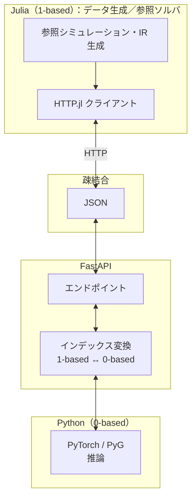

<!-- _class: lead -->

# 【Julia × FastAPI】  
# 長期ロールアウトを安定させる物理学サロゲート

**Discrete DEC-GNN と DDM／Heun を束ねて**

公開リポジトリ *Physics GNN Surrogate · Long Rollout Stabilization* に基づく概説

---

## 今日的な課題

- 教師信号にだけ合わせると、一枚のステップではまともに見えても  
  **自分の予測を次の入力に積む自己回帰**では数十〜数百ステップで破綻しがち
- グラフニューラルサロゲートで典型的な問題：
  - 時間離散が粗く **エネルギー様の構造を壊す**
  - 全体を一度に扱えず **GPU とメッシュ規模が板挟み**
  - 局所 MP だけでは **長距離相関が届きにくい**

👉 時間・空間・長距離の三方向に手を打つ構成が必要になりますね。

---

## 時間側の一手：外出しされた Heun 積分

潜在状態 \(h\) に対しニューラルが \(
f_\theta(h) \approx dh/dt
\) を与えるとき、**改良オイラー（Heun）**で状態を進めます。

$$
h^{(t+1)} = h^{(t)} + \frac{\Delta t}{2} \left(
f_{\theta}(h^{(t)}) + f_{\theta}(\tilde h^{(t+1)})
\right)
$$

- 単純オイラー 1 ステップより滑らかで、時間方向の暴走を緩める狙いがあります。
- さらに離散ハミルトニアンのジャンプを罰する **Symplectic ロス**で、長尺でもエネルギーが漂いにくいように設計できます。

---

## 空間側：DDM と Halo 同期

- 巨大グラフは **グラフ分割**でパッチに分け、各パッチに **1-hop Halo（ゴースト層）** を載せる
- メッセージパッシングと時間更新は **パッチ内 → 境界を `sync` で全局整合**

**ポイント**

- メモリはパッチ単位で抑える
- 「パッチ内ダイナミクス」と「境界同期」が分離でき、並列線形代数の経験と対応して想像しやすい

---

## 長距離：Restriction／Prolongation と粗格子

- 細 \(\to\) 粗の **Restriction \(R\)**
- 粗 \(\to\) 細の **Prolongation \(P\)**
- 粗スケールでテンソル型メッセージをまわすことで **長波長モード**を効率よく扱う

時間積分・DDM・マルチグリッドはそれぞれ **差し替え可能なモジュール**として合成できる、という見立てになりますね。

---

## アーキテクチャ：**Julia × FastAPI × PyTorch／PyG**

- **Julia**：参照シミュレーション・データ・IR。**ノード／エッジ索引は 1-based 慣習**
- **Python**：PyTorch／PyG。**テンソルと COO は 0-based**
- **FastAPI**：HTTP＋JSON の **疎結合境界**
- API 局で **`1-based ↔︎ 0-based` を往復させるインデックス契約** を一度に書く——ここが再現可能な運用の要ですね。

---

## 構成図（Mermaid）

Julia と Python のズレが **サイレントに効かないように**している、というのが視覚で伝わると嬉しいです。

---

## 結果：長期ロールアウトの波形重合

評価では、参照波形とサロゲートの **自己回帰軌道** を重ね、`RMSE` や離散ハミルトニアンにもとづくドリフトを確認します。

---

## ROI のイメージ

- **ゼロショット自己回帰**で離散モデルと数値的比較
- 離散モデルのマクロステップ時間と GPU 上サロゲート 1 ステップを比べ **Speedup** を整理
- 数千倍級はシナリオ次第ですが、「フル離散モデルを毎回回さなくて済む検証」の **時間短縮**がメリットになりますね。

---

## まとめ

| レイヤ       | アイデア |
|-------------|-----------|
| 時間        | Heun（＋離散ハミルトニアンの Symplectic ロスで長尺を支える） |
| 空間        | DDM＋ Halo 同期 |
| 長距離      | \(R,P\) と粗格子 MP |
| 運用／境界  | **FastAPI と `HTTP.jl`、索引の明示的ラウンドトリップ** |

チャンネル **Mathematical Science Note** では、離散モデル × 深学習 × 多言語インフラの交差点をゆっくり掘り下げていきます。また次回。
